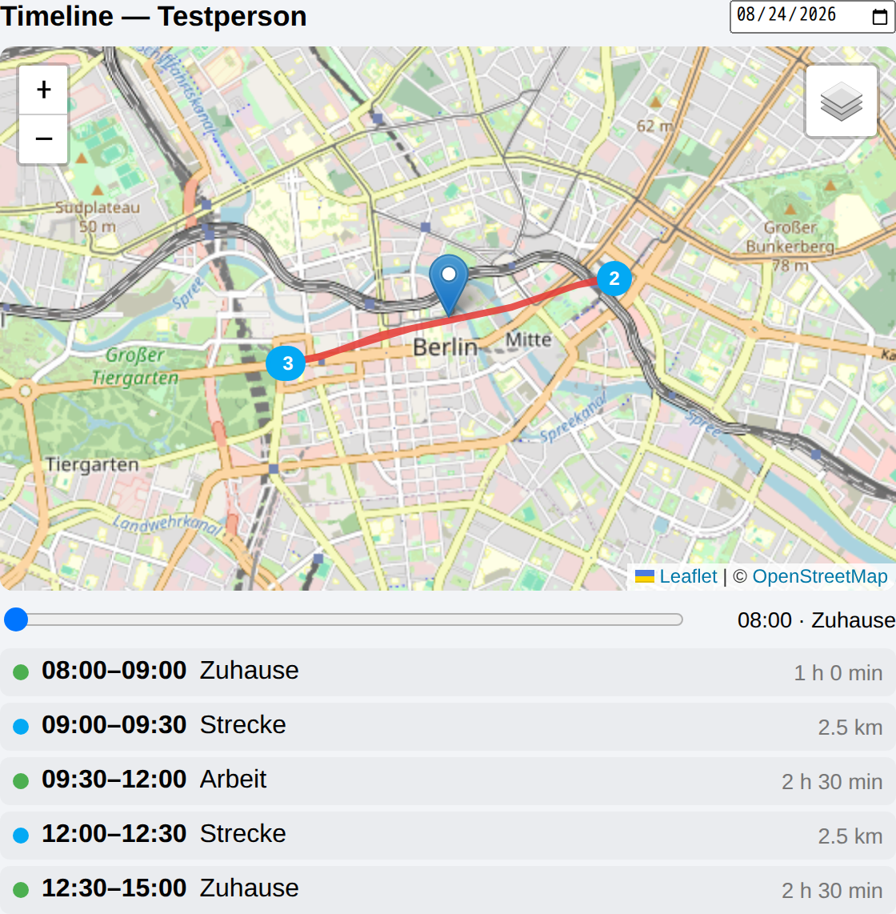
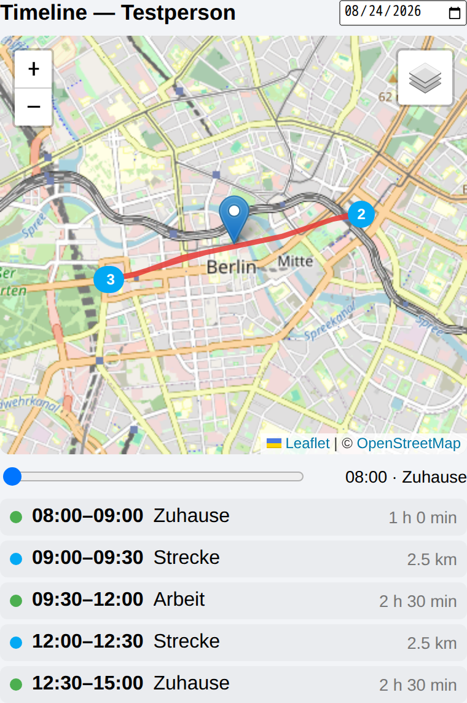

# Busch Cards

[](https://hacs.xyz/)
[](https://github.com/luukkii123/ha-busch-cards/releases)
[](LICENSE)

**Zwei eigene Lovelace-Karten für Home Assistant: ein Zeitplan-Editor direkt im
Dashboard und ein Tagesverlauf auf der Landkarte.**

| Karte | Wofür | Braucht |
| --- | --- | --- |
| `busch-schedule-card` | Zeitplan-Helfer (`schedule.*`) im Dashboard bearbeiten | nichts weiter |
| `busch-timeline-card` | Tages-Track einer Person auf der Karte | Integration [Local Track](https://github.com/luukkii123/ha-localtrack-integrations) |


Beide Karten stecken in einer Datei. **Kein Build-Schritt** —
`dist/busch-cards.js` ist Quelltext *und* Auslieferung: reines Vanilla-JS mit
Custom Elements. Leaflet steckt für die Timeline-Karte mit drin, samt CSS und
Marker-Bildern; nachgeladen wird nichts. Das erklärt die Dateigröße.

## Installation über HACS

1. HACS → ⋮ → **Custom repositories**
2. Repository: `https://github.com/luukkii123/ha-busch-cards`,
   Kategorie: **Dashboard**
3. **Busch Cards** herunterladen, Seite neu laden (Strg+F5)

Manuell: `dist/busch-cards.js` nach `<config>/www/busch-cards.js` kopieren und
unter Einstellungen → Dashboards → ⋮ → **Ressourcen** eintragen:
`/local/busch-cards.js`, Typ **JavaScript-Modul**.

Danach tauchen beide Karten in der Kartenauswahl auf — als **Busch Zeitplan**
und **Busch Timeline**, jeweils mit Vorschau und grafischem Editor.

Voraussetzung: Home Assistant **2024.11.0** oder neuer.

---

# `busch-schedule-card`

Zeitplan-Helfer (`schedule.*`) direkt im Dashboard bearbeiten. Home Assistant
bringt für Zeitpläne einen Editor mit, aber nur im Helfer-Dialog unter
Einstellungen — auf einer Dashboard-Karte gab es das bisher nicht.

```yaml
type: custom:busch-schedule-card
entity: schedule.pool_zeitplan
title: Poolpumpe        # optional, sonst der Name der Entität
first_day: auto         # auto | monday | sunday
step: 15                # Raster beim Ziehen, in Minuten
```

## Optionen

| Option | Pflicht | Standard | Bedeutung |
| --- | --- | --- | --- |
| `entity` | ja | — | eine `schedule.*`-Entität; alles andere wird abgelehnt |
| `title` | nein | Name der Entität | Überschrift der Karte |
| `first_day` | nein | `auto` | Wochenanfang; `auto` folgt der Einstellung in Home Assistant |
| `step` | nein | `15` | Raster beim Ziehen in Minuten, 1–60 (der Editor bietet 5–60 in Fünferschritten) |
| `icon` | nein | `mdi:calendar-clock` | nur der Rückfallwert — hat die Entität ein eigenes Icon, gewinnt das |

Wochentagsnamen und Uhrzeiten folgen der Sprache von Home Assistant. Die Karte
zeigt immer 24 Stunden, unabhängig von der 12/24-Stunden-Einstellung.

## Bedienung

| Geste | Wirkung |
| --- | --- |
| Auf freie Fläche ziehen | neuen Block in der gezogenen Länge anlegen |
| Auf freie Fläche tippen | Block über eine Stunde anlegen (oder so viel Platz ist) |
| Block ziehen | verschieben |
| Blockrand ziehen | Anfang oder Ende verschieben |
| Block antippen | Dialog mit Von/Bis und **Löschen** |
| Wochentag antippen | Tag leeren, oder seine Blöcke auf alle Tage / Mo–Fr / Sa+So kopieren |

Mit der Tastatur: Blöcke sind anspringbar, **Enter** oder **Leertaste** öffnet
den Dialog.

Gespeichert wird sofort nach jeder Änderung. Schlägt das fehl, springt die Karte
auf den letzten bestätigten Stand zurück und zeigt die Meldung von Home
Assistant an — ein halb gespeicherter Zeitplan entsteht nicht.

## Mobil und am Bildschirm


Der Umbruch hängt an der **Kartenbreite**, nicht an der Fenstergröße
(Container-Query) — eine schmale Spalte am großen Bildschirm bekommt also
dasselbe wie ein Handy: höhere Spuren zum Treffen mit dem Finger, ein Lineal nur
alle sechs Stunden, und Beschriftungen genau dann, wenn sie hineinpassen.

Waagrechtes Ziehen gehört der Karte, senkrechtes Wischen scrollt weiterhin die
Seite (`touch-action: pan-y`). Die Zeitfelder im Dialog sind native
`<input type="time">`, am Handy erscheint also der Systempicker.

> Das native Zeitfeld formatiert nach der **Sprache des Browsers**, nicht nach
> der Einstellung von Home Assistant. Bei deutschem Browser sind das 24 Stunden.

## Was die Karte über die Regeln von Home Assistant weiß

Der Zeitplan-Helfer prüft streng. Die Karte hält sich daran, statt in einen
Fehler zu laufen:

- Blöcke dürfen sich **berühren** (`04:00` Ende, `04:00` Anfang), aber nicht
  überlappen. Beim Ziehen sind die Nachbarn deshalb harte Anschläge.
- Anfang muss **vor** dem Ende liegen; gleiche Zeiten sind ungültig.
- Ein Block darf bis Mitternacht laufen. Im Dialog gibt man dafür `00:00` als
  Endzeit an, im Balken steht `24:00`.
- `schedule/update` **ersetzt den ganzen Datensatz**. Die Karte schickt deshalb
  bei jedem Speichern Name, Icon, alle sieben Tage und ein etwaiges `data` je
  Block mit — sonst wäre nach dem ersten Ziehen das Icon weg.

## Aussehen anpassen

Die Karte nutzt ausschließlich HA-eigene CSS-Variablen, folgt also dem gewählten
Theme in hell und dunkel. Zwei eigene Variablen lassen sich im Theme
überschreiben:

```yaml
busch-schedule-color: "#e65100"        # Farbe der Blöcke
busch-schedule-track-color: "#37474f"  # Hintergrund der Tagesspur
```

## Grenzen

- Ein in YAML festgelegter Zeitplan (`editable: false`) wird nur **angezeigt**;
  die Speicher-API greift dort nicht. Die Karte schaltet dann in den Lesemodus.
- Zum Auflösen der `schedule_id` liest die Karte die Entitätsregistrierung. Ohne
  Adminrechte fällt sie auf den Namen hinter dem Punkt zurück — nach einer
  Umbenennung der Entität kann das danebengehen.
- Der Block-Dialog kennt nur Von und Bis. Das freie Feld `data` je Block wird
  unverändert durchgereicht, aber nicht angezeigt und nicht bearbeitet.

---

# `busch-timeline-card`

Tages-Track einer Person auf der Landkarte: Route, Aufenthalte und ein
Zeit-Scrubber — Googles Zeitachse als eigene Karte.



```yaml
type: custom:busch-timeline-card
entity: person.beispiel
title: Mein Tag         # optional, sonst die Entitäts-ID
height: 320             # Kartenhöhe in px
stay_radius_m: 150      # Radius, in dem Punkte als „Aufenthalt" gelten
min_stay_minutes: 10    # Mindestdauer eines Aufenthalts
show_scrubber: true     # Zeit-Scrubber ein-/ausblenden
reverse_geocode: false  # Ortsnamen über OSM/Nominatim abfragen
max_points: 2000        # max. Punkte pro Tag
tile_url: ""            # leer = OpenStreetMap, sonst eigener Kachelserver
```

## Voraussetzung

Die Karte braucht die Integration
[**Local Track**](https://github.com/luukkii123/ha-localtrack-integrations) —
sie liefert das WebSocket-Kommando `localtrack/history`, über das die Karte
ausschließlich liest. Ist die Integration installiert, aber kein Eintrag
angelegt, meldet die Karte „Local-Track-Integration nicht eingerichtet."; geht
die Abfrage aus einem anderen Grund schief, „Daten konnten nicht geladen
werden."

Warum zwei Repos: In HACS gehört ein Repository zu **genau einer** Kategorie.
Karten und Integrationen lassen sich deshalb nicht zusammen ausliefern.

## Optionen

| Option | Pflicht | Standard | Bedeutung |
| --- | --- | --- | --- |
| `entity` | ja | — | eine `person.*`- oder `device_tracker.*`-Entität |
| `title` | nein | Entitäts-ID | Überschrift der Karte |
| `height` | nein | `320` | Kartenhöhe in px (Editor: 240–720) |
| `stay_radius_m` | nein | `150` | bis zu diesem Abstand vom laufenden Mittelpunkt zählen Punkte als ein Aufenthalt (Editor: 10–1000) |
| `min_stay_minutes` | nein | `10` | so lange muss ein Aufenthalt gedauert haben, um zu zählen (Editor: 1–240) |
| `show_scrubber` | nein | `true` | Zeit-Scrubber unter der Karte anzeigen |
| `reverse_geocode` | nein | `false` | Aufenthalte ohne passende Zone über OSM/Nominatim benennen |
| `max_points` | nein | `2000` | so viele Punkte holt die Karte höchstens (Editor: 100–5000) |
| `tile_url` | nein | leer | leer = OpenStreetMap, sonst eine eigene Kachel-URL im Leaflet-Format |

## Bedienung

- **Datum** oben rechts wählen (Standard: heute); die Karte lädt den Track
  dieses Tages.
- **Zeit-Scrubber** unter der Karte: entlang der Route fahren, daneben stehen
  Uhrzeit und Zone (oder „unterwegs").
- **Aufenthalte** und **Strecken** erscheinen als Liste unter der Karte, mit
  Zeitspanne und Dauer bzw. Länge in Kilometern. Ein Klick zentriert die Karte
  darauf.
- Start (grün) und Ende (rot) sind markiert, Aufenthalte als nummerierte Pins in
  der Reihenfolge des Tages.

Aufenthalte werden zuerst gegen die **Zonen** von Home Assistant beschriftet;
passt keine, heißt der Eintrag „Aufenthalt" — oder, mit
`reverse_geocode: true`, wie der von OSM gelieferte Straßen- bzw. Ortsname.

Steht das Datum auf **heute**, lädt die Karte nach einer Positionsänderung
verzögert nach (rund 30 Sekunden). Vergangene Tage ändern sich nicht und werden
nicht neu geladen.

Auf schmalen Spalten rückt die Karte zusammen, die Segmentliste bleibt lesbar:



## Grenzen

- **Noch nicht in einem laufenden Home Assistant getestet.** Die Karte wurde in
  einem Chromium-Container gegen erfundene Daten gerendert; das Zusammenspiel
  mit einer echten Installation steht aus.
- **Kartenkacheln kommen von openstreetmap.org**, solange `tile_url` leer ist.
  Wer das nicht will, trägt einen eigenen Kachelserver ein.
- **`reverse_geocode: true` schickt Koordinaten an einen Dritten**
  (nominatim.openstreetmap.org). Standardmäßig ist das aus; die Zonen-Zuordnung
  bleibt vollständig lokal.
- **Die Routenqualität hängt an der Quelle, nicht am Code.** Die Companion-App
  meldet den Standort im Standardmodus nur bei deutlicher Bewegung oder
  Zonenwechsel — die Linien zwischen den Punkten sind dann gerade. „Hohe
  Genauigkeit" in der App (kostet Akku) liefert dichtere Spuren.
- **Ein Tag auf einmal.** Es gibt keine Wochen- oder Monatsansicht und keinen
  Vergleich mehrerer Personen in einer Karte.
- Liegen mehr Punkte vor als `max_points`, reduziert die **Integration** sie mit
  Douglas-Peucker, bevor die Karte sie sieht.

---

## Eine weitere Karte hinzufügen

Alles passiert in `dist/busch-cards.js`:

1. Klasse `extends HTMLElement` mit `setConfig(config)`, `set hass(hass)` und
   `getCardSize()`.
2. `customElements.define("busch-xyz-card", BuschXyzCard)`.
3. Eintrag in `window.customCards` anhängen, damit sie in der Kartenauswahl
   erscheint.

Der Dateiname bleibt `busch-cards.js` — er steht in `hacs.json` unter `filename`
und ist der Vertrag mit HACS. Wird er geändert, findet HACS die Karten nicht
mehr.

## Veröffentlichen

`CARD_VERSION` in `dist/busch-cards.js` hochziehen, committen, dann:

```bash
git tag v0.2.0 && git push origin v0.2.0
```

Das Release entsteht **automatisch**: `.github/workflows/release.yml` reagiert
auf den Tag, legt das Release an und hängt `busch-cards.js` als Asset dran. In
HACS erscheint danach ein Update.

`.github/workflows/validate.yml` prüft bei jedem Push mit der HACS-Action, ob
das Repo installierbar bleibt.

## Lizenz

MIT — siehe [LICENSE](LICENSE).
