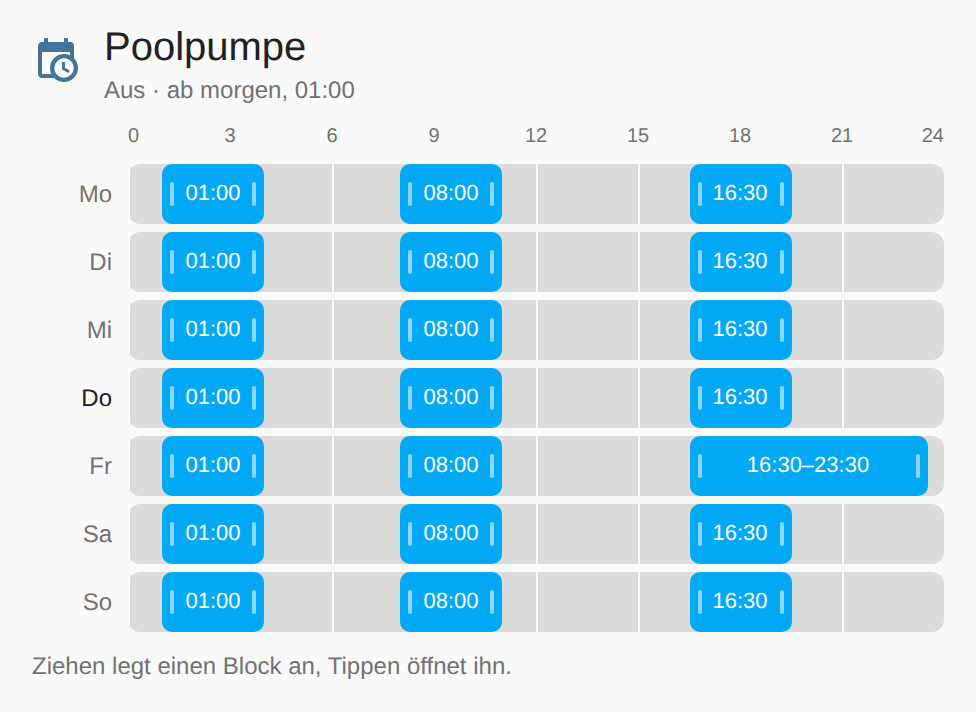
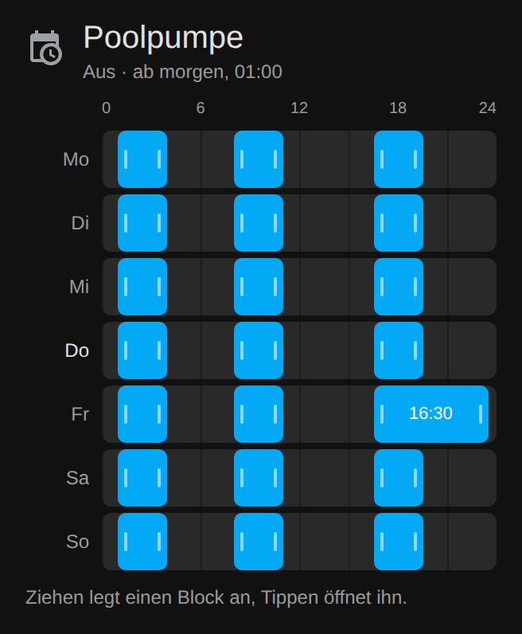

# Busch Cards — Lovelace-Karten

[](https://hacs.xyz/)
[](https://github.com/luukkii123/ha-busch-cards/releases)
[](LICENSE)

Eigene Karten für Home-Assistant-Dashboards, installierbar über HACS.
**Kein Build-Schritt** — `dist/busch-cards.js` ist Quelltext *und* Auslieferung.



## Installation über HACS

1. HACS → ⋮ → **Custom repositories**
2. Repository: `https://github.com/luukkii123/ha-busch-cards`, Kategorie: **Dashboard**
3. **Busch Cards** herunterladen, Seite neu laden (Strg+F5)

Manuell: `dist/busch-cards.js` nach `<config>/www/busch-cards.js` kopieren und
unter Einstellungen → Dashboards → ⋮ → **Ressourcen** eintragen:
`/local/busch-cards.js`, Typ **JavaScript-Modul**.

## `busch-schedule-card`

Zeitplan-Helfer (`schedule.*`) direkt im Dashboard bearbeiten. Home Assistant
bringt für Zeitpläne einen Editor mit, aber nur im Helfer-Dialog unter
Einstellungen — auf einer Dashboard-Karte gab es das bisher nicht.

```yaml
type: custom:busch-schedule-card
entity: schedule.pool_zeitplan
title: Poolpumpe        # optional, sonst der Name der Entität
first_day: auto         # auto | monday | sunday
step: 15                # Raster beim Ziehen, in Minuten
```

Ein grafischer Editor ist dabei — die Karte taucht in der Kartenauswahl unter
**Busch Zeitplan** auf, mit Vorschau.

### Optionen

| Option | Pflicht | Standard | Bedeutung |
| --- | --- | --- | --- |
| `entity` | ja | — | eine `schedule.*`-Entität |
| `title` | nein | Name der Entität | Überschrift der Karte |
| `first_day` | nein | `auto` | Wochenanfang; `auto` folgt der Einstellung in Home Assistant |
| `step` | nein | `15` | Raster beim Ziehen in Minuten, 5–60 |

### Bedienung

| Geste | Wirkung |
| --- | --- |
| Auf freie Fläche ziehen | neuen Block in der gezogenen Länge anlegen |
| Auf freie Fläche tippen | Block über eine Stunde anlegen (oder so viel Platz ist) |
| Block ziehen | verschieben |
| Blockrand ziehen | Anfang oder Ende verschieben |
| Block antippen | Dialog mit Von/Bis und **Löschen** |
| Wochentag antippen | Tag leeren oder auf andere Tage kopieren |

Mit der Tastatur: Blöcke sind anspringbar, **Enter** oder **Leertaste** öffnet
den Dialog.

Gespeichert wird sofort nach jeder Änderung. Schlägt das fehl, springt die
Karte auf den letzten bestätigten Stand zurück und zeigt die Meldung von Home
Assistant an — ein halb gespeicherter Zeitplan entsteht nicht.

### Mobil und am Bildschirm



Der Umbruch hängt an der **Kartenbreite**, nicht an der Fenstergröße
(Container-Query) — eine schmale Spalte am großen Bildschirm bekommt also
dasselbe wie ein Handy: höhere Spuren zum Treffen mit dem Finger, ein Lineal
nur alle sechs Stunden, und Beschriftungen genau dann, wenn sie hineinpassen.

Waagrechtes Ziehen gehört der Karte, senkrechtes Wischen scrollt weiterhin die
Seite (`touch-action: pan-y`). Die Zeitfelder im Dialog sind native
`<input type="time">`, am Handy erscheint also der Systempicker.

> Das native Zeitfeld formatiert nach der **Sprache des Browsers**, nicht nach
> der 12/24-Stunden-Einstellung von Home Assistant. Bei deutschem Browser sind
> das 24 Stunden. Die Karte selbst zeigt immer 24 Stunden.

### Was die Karte über die Regeln von Home Assistant weiß

Der Zeitplan-Helfer prüft streng. Die Karte hält sich daran, statt in einen
Fehler zu laufen:

- Blöcke dürfen sich **berühren** (`04:00` Ende, `04:00` Anfang), aber nicht
  überlappen. Beim Ziehen sind die Nachbarn deshalb harte Anschläge.
- Anfang muss **vor** dem Ende liegen; gleiche Zeiten sind ungültig.
- Ein Block darf bis Mitternacht laufen. Im Dialog gibt man dafür `00:00` als
  Endzeit an, im Balken steht `24:00`.
- `schedule/update` **ersetzt den ganzen Datensatz**. Die Karte schickt deshalb
  bei jedem Speichern Name, Icon, alle sieben Tage und ein etwaiges `data` je
  Block mit — sonst wäre nach dem ersten Ziehen das Icon weg.

Ein in YAML festgelegter Zeitplan (`editable: false`) wird nur angezeigt; die
Speicher-API greift dort nicht.

### Aussehen anpassen

Die Karte nutzt ausschließlich HA-eigene CSS-Variablen, folgt also dem
gewählten Theme in hell und dunkel. Zwei eigene Variablen lassen sich im Theme
überschreiben:

```yaml
busch-schedule-color: "#e65100"        # Farbe der Blöcke
busch-schedule-track-color: "#37474f"  # Hintergrund der Tagesspur
```

## Eine weitere Karte hinzufügen

Alles passiert in `dist/busch-cards.js`:

1. Klasse `extends HTMLElement` mit `setConfig(config)`, `set hass(hass)` und
   `getCardSize()`.
2. `customElements.define("busch-xyz-card", BuschXyzCard)`.
3. Eintrag in `window.customCards` anhängen, damit sie in der Kartenauswahl
   erscheint.

Der Dateiname bleibt `busch-cards.js` — er steht in `hacs.json` unter
`filename` und ist der Vertrag mit HACS. Wird er geändert, findet HACS die
Karten nicht mehr.

## Veröffentlichen

`CARD_VERSION` in `dist/busch-cards.js` hochziehen, committen, dann:

```bash
git tag v0.2.0 && git push origin v0.2.0
```

Das Release entsteht **automatisch**: `.github/workflows/release.yml` reagiert
auf den Tag, legt das Release an und hängt `busch-cards.js` als Asset dran. In
HACS erscheint danach ein Update.

`.github/workflows/validate.yml` prüft bei jedem Push mit der HACS-Action, ob
das Repo installierbar bleibt.

## Lizenz

MIT — siehe [LICENSE](LICENSE).
